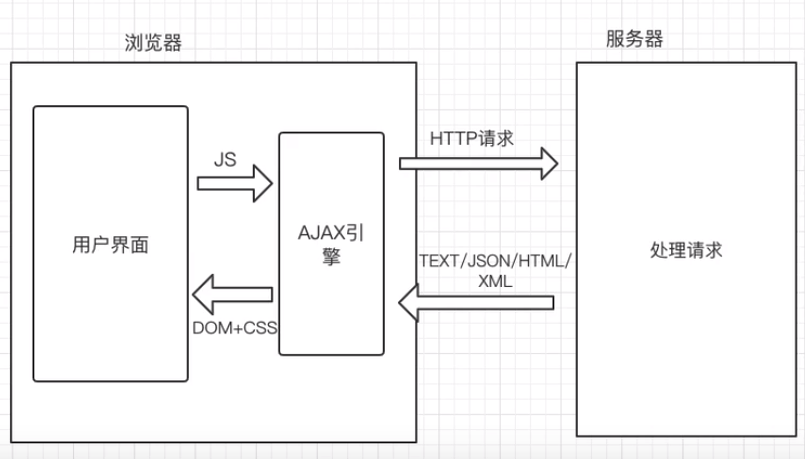

# Ajax

Asynchronous JavaScript And XML：异步的JavaScript和XML 

AJAX不是新的编程语言，指的是一种交互方式，异步加载，客户端和服务器的数据交互更新在局部页面的技术，不需要刷新整个页面（局部刷新）

优点：
1、局部刷新，效率更高
2、用户体验更好


不能用表单提交请求，改用jQuery方式动态绑定事件来提交。

```jsp
<%@ page contentType="text/html;charset=UTF-8" language="java" %>
<html>
<head>
    <title>Title</title>
    <script type="text/javascript" src="js/jquery-3.5.0.min.js"></script>
    <script type="text/javascript">
        $(function () {
            var btn = $("#btn");
            btn.click(function () {
                $.ajax({
                    url:'/test',
                    type:' post', 
                    data:' id=1', 
                    dataType:' text', 
                    success: function(data) {
                        var text = $("#text");
                        text.before("<span>" + data + "</span><br/>");
                    }
                    });
            });
        })
    </script>
</head>
<body>

    ${str}
    <input type="text"/><br/>
    <input id="btn" type="button" value="提交"/>

</body>
</html>

```

Servlet 不能跳转到JSP，只能将数据返回，否则ajax取到的data为跳转页面信息

```java
@WebServlet("/test")
public class TestServlet extends HttpServlet {
    @Override
    protected void doPost(HttpServletRequest req, HttpServletResponse resp) throws ServletException, IOException {
        String id=req.getParameter("id");
        try{
            Thread. sleep(3000);
        } catch(InterruptedException e) {
            e.printStackTrace();
        }
            String str="Hello World";
            resp.getWriter(). write(str);
//            req.setAttribute("str", str);
//            req.getRequestDispatcher("test. jsp").forward(req, resp);
    }
}
```

返回对象

```java
@WebServlet("/test")
public class TestServlet extends HttpServlet {
    @Override
    protected void doPost(HttpServletRequest req, HttpServletResponse resp) throws ServletException, IOException {
        User user=new User(1,"张三",96.5)；
        //将Java对象转为JSON格式
        JSONObject JSONObject=JSONObject.fromObject(user);
        resp.getwriter().write(jsonObject.toString());
    }
}
```


## 传统的WEB数据交互VSAJAX数据交互


- 客户端请求的方式不同：
  - 传统，浏览器发送同步请求（form、a）
  - AJAX，异步引擎对象发送异步请求

- 服务器响应的方式不同：
  - 传统，响应一个完整JSP页面（视图）
  - AJAX，响应需要的数据

- 客户端处理方式不同：
  - 传统：需要等待服务器完成响应并且重新加载整个页面之后，用户才能进行后续的操作
  - AJAX：动态更新页面中的局部内容，不影响用户的其他操作




## 基于jQjuery的Ajax语法

**$.ajax({属性})**

常用的属性参数：
url：请求的后端服务地址
type：请求方式，默认get 
data：请求参数(相当于?key=value&....)
dataType：服务器返回的数据类型，text/json 
success：请求成功的回调函数
error：请求失败的回调函数
complete：请求完成的回调函数（无论成功或者失败，都会调用,成功则complete先调用，失败则error先调用）