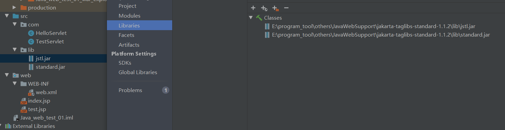

# EL表达式

Expression Language 表达式语言，替代JSP页面中数据访问时的复杂编码，可以非常便捷地取出域对象
（pageContext、request、session、application）中保存的数据，前提是一定要先 setAttribute，EL就相当于在简化 getAttribute

语法：${变量名}

```jsp
<%
	pageContext. setAttribute("name","page"); 
	request. setAttribute("name","request"); 
	session. setAttribute("name","session"); 
	application. setAttribute("name","application");
%>
```

```JSP
${name}
```

1、EL对于4种域对象的查找顺序：
agecontext-》request-》session-》application

按照上述的顺序进行查找，找到立即返回，在application中也无法找到，则返回null


2、指定作用域进行查找

pageContext:       $(pageScope.name}

request:                ${requestScope.name}

session:                ${sessionScope.name}

application:         $(applicationScope.name}


数据级联：

```JSP
<%
//pageContext.setAttribute（"name"，"page"）；
//request.setAttribute（"name"，"request"）；
//session.setAttribute（"name"，"session"）；
//application.setattribute（"name"，"application"）；

User user=new User(1,"张三",86.5,new Address(1,"小寨"));
System.out.print1n(user.tostring());
pageContext.setAttribute("user",user);

<table>
	<tr>
		<th>编号</th>
        <th>姓名</th>
        <th>成绩</th>
        <th>地址</th>
	</tr>
	<tr>
        <td>S{user.id}</td> //或者$(user["id"]}
        <td>S{user.name}</td>
        <td>S{user.score}</td>
        <td>S{user.address}</td>
	</tr>
</table>
```


EL执行表达式

```
&&  ||  !  <  >  <=  <=  ==
&&   and
||   or
! 	 not
==   eq
!=   ne
<    1t
>    gt
<=   le
>=   ge
empty  变量为nu11/长度的0的String/size为0的集合
```


## JSTL

JSP Standard Tag LibraryJSP标准标签库，JSP为开发者提供的一系列的标签，使用这些标签可以完成一些逻辑处理，比如循环遍历集合，让代码更加简洁，不再出现JSP脚本穿插的情况。

实际开发中EL和JSTL结合起来使用，JSTL侧重于逻辑处理，EL负责展示数据。

#### JSTL使用

1、需要导入jar包（两个jstl.jar standard.jar）



2、在JSP页面开始的地方导入JSTL标签库

```JSP
<%--用c代表uri--%>
<%@ taglib prefix="c" uri="http://java.sun.com/jsp/jstl/core" %> 
```

3、在需要的地方使用

```jsp
<%--从list中取出user对象--%>
<c:forEach items="${list}"var="user">
	<tr>
		<td>${user.id}</td>
		<td>${user.name}</td>
		<td>${user.score}</td>
		<td>${user.address.value}</td>
    </tr>
</c:forEach>
```

JSTL优点：
1、提供了统一的标签
2、可以用于编写各种动态功能

常用标签：
set、out、remove、catch

set：向域对象中添加数据

```jsp 
<%
	requset.setAttribute("name","tom");
%>

<%--作用相同--%>
<c:set var="name" value="tom" scope="request"></c:set>

<%--进行修改，但不能将一个对象直接传入（user对象必须通过setAttribute传入）--%>
<c:set target="${user}" property="name" value="李四"></c:set>
```

out:输出域对象中的数据

```jsp
<%--需要el表达式--%>
<c:out value="${name}" default="未定义"></c:out>
```

remove：输出域对象中的数据

```jsp
<c:remove var="name" scope="page"></c:remove>
```

catch:捕获异常

```JSP
<c:catch var="error">
<%
	int a=10/0;
%>
</c:catch>
${error}
```

 ####  条件标签

if:

```JSP
<%--num1>num2页面显示ok否则显示fail--%>
<c:if test="${numl>num2}">ok</c:if>
<c:if test="${numl<num2}">fail</c:if>
```

choose:类似if else

```jsp
<c:choose>
    <c:when test="${numl>num2}">ok</c:when>
    <c:otheryise>fail</c:otherwise>
</c:choose>
```

#### 迭代标签 forEach

常用

```JSP
<%--从begin开始包括end，步伐为2--%>
<c:forEach items="${list}" var="str" begin="2" end=7" step="2" varStatus="sta">
	${sta.count}、${str}<br/>
</c:forEach>
```

#### 格式化标签（数字、日期）

实际开发并不会把格式转换用在jSP

```jsp
<%
	request. setAttribute("date", new Date());
%>
<fmt: formatDate value="${date}" pattern="yyyy-MM-dd HH:mm:ss"></fmt: formatDate>
```

#### 字符串操作

```jsp
<%@ taglib prefix="fn" uri="http://java.sun.com/jsp/jstl/core" %> 
<%
	request.setAttribute("info","Java,C");
%>

${fn:contains(info,"Python")}<br/>
${fn:startswith(info,"Java")}<br/>
${fn:endswith(info,"C")}<br/>
${fn:index0f(info,"va")}<br/>
${fn:replace(info,"c","Python")}<br/>
${fn:substring(info,2,3)}<br/>
${fn:split(info,",")[0]}-${fn:split(info,",")[1]}
```

