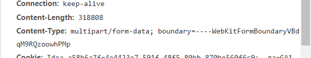

# 文件上传

- jsp文件
  - 1、input的type设置为file、
  - 2、form表单的method设置post，get请求会将文件名传给服务端，而不是文件本身
  - 3、form表单的enctype 设置multipart/form-data，以二进制的形式传输数据

```jsp
<form enctype="multipart/form-data" action="/upload"  method="post">
        <input name="img" type="file"/>
        <input type="submit" value="提交"/>
</form>
```




​															图片以流的形式传入服务器

基础底层实现txt上传

```java
@Override
    protected void doPost(HttpServletRequest req, HttpServletResponse resp) throws ServletException, IOException {
        //假设传的是txt文件
        //层层包装加速读取
        InputStream in = req.getInputStream();
        InputStreamReader reader = new InputStreamReader(in);
        BufferedReader bufferedReader = new BufferedReader(reader);
        //获取当前项目路径,注意是在out/artifacts/项目名 目录下
        String path = req.getServletContext().getRealPath("file/copy.txt");
        //层层包装加速写出
        OutputStream out = new FileOutputStream(path);
        Writer writer = new OutputStreamWriter(out);
        BufferedWriter bufferedWriter = new BufferedWriter(writer);
        String str = "";
        while((str=bufferedReader.readLine())!=null){
            bufferedWriter.write(str);
        }

        bufferedWriter.close();
        writer.close();
        out.close();
        bufferedReader.close();
        reader.close();
        in.close();
    }
```

由于直接这样写不满足需求（换行，文件类型等），可以使用sun公司提供好的实现类

- servlet 
  - fileupload组件可以将所有的请求信息都解析成Fileltem对象，可以通过对Fileltem对象的操作完成上传，面向对象的思想，需要的java包是commons-io.jar和commons-fileupload.jar

```java
@Override
    protected void doPost(HttpServletRequest req, HttpServletResponse resp) throws ServletException, IOException {
        try {
            DiskFileItemFactory fileItemFactory = new DiskFileItemFactory();
            ServletFileUpload servletFileUpload = new ServletFileUpload(fileItemFactory);
            List<FileItem> list = servletFileUpload.parseRequest(req);
            for(FileItem file : list){
                if(file.isFormField()){
                    //不是文件，而是输入的文本信息
                    String name = file.getName();
                    String value = file.getString("UTF-8");
                    System.out.println();
                }else{
                    //是文件
                    String name = file.getName();
                    long size = file.getSize();
                    System.out.println(name + ":"+size+" Byte");
                    InputStream in = file.getInputStream();
                    String path = req.getServletContext().getRealPath("file"+name);
                    OutputStream out = new FileOutputStream(path);
                    int temp = 0;
                    while((temp=in.read())!=-1){
                        out.write(temp);
                    }
                    out.close();
                    in.close();
                    System.out.println("上传成功");
                }
            }
        } catch (FileUploadException e) {
            e.printStackTrace();
        }
    }
```


# 文件下载

```java
@WebServlet("/download")
public class DownloadServlet extends HttpServlet {
    @Override
    protected void doGet(HttpServletRequest req, HttpServletResponse resp) throws ServletException, IOException {
        //resp的两个设置是写死的
        //设置响应方式，调用浏览器下载工具
        resp.setContentType("application/x-msdownload");
        String filename = "test.txt";
        //设置下载之后的文件名
        resp.setHeader("Content-Disposition","attachment；filename="+filename);
        //获取输出流
        OutputStream out = resp.getOutputStream();
        String path = req.getServletContext().getRealPath("file/test.txt");
        InputStream in = new FileInputStream(path);
        int temp=0;
        while((temp=in.read())!=-1){
            out.write(temp);
        }
        in.close();
        out.close();
    }
}

```

