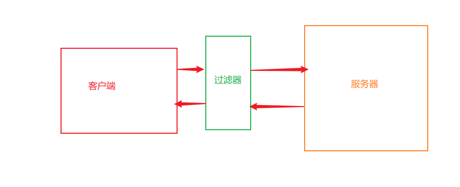

# 过滤器Filter（与SpringMVC的拦截器区别）

与使用Servlet类似，Filter是Java WEB提供的一个接口，开发者只需要自定义一个类并且实现该接口即可。

功能：
1、用来拦截传入的请求和传出的响应。
2、修改或以某种方式处理正在客户端和服务端之间交换的数据流。



```java
public class MyFilter implements Filter {
    @Override
    public void init(FilterConfig filterConfig) throws ServletException {

    }

    @Override
    public void doFilter(ServletRequest servletRequest, ServletResponse servletResponse, FilterChain filterChain) throws IOException, ServletException {
        servletRequest.setCharacterEncoding("UTF-8");
         //默认会中断请求，所以需要继续转发
        filterChain.doFilter(servletRequest, servletResponse);
       
    }

    @Override
    public void destroy() {

    }
}

```

在web.xml配置Filter,xml里Filter的顺序就是实际的顺序

```xml
<filter>
        <filter-name>myFilter</filter-name>
        <filter-class>com.MyFilter</filter-class>
    </filter>
    <filter-mapping>
        <filter-name>myFilter</filter-name>
        <url-pattern>/login</url-pattern>
        <url-pattern>/test</url-pattern>
    </filter-mapping>
```

注意：doFilter 方法中处理完业务逻辑之后，必须添加filterChain.doFilter(servletRequest，servletResponse);否则请求/响应无法向后传递，一直停留在过滤器中。


也可以基于注解，但是不能定义多个Filter顺序

```java
@WebFilter("/login")
public class MyFilter implements Filter {
}
```


### Filter生命周期

当Tomcat启动时，通过反射机制调用Filter的无参构造函数创建实例化对象，同时调用init方法实现初始化，doFilter 方法有多少请求调用多少次，当Tomcat 服务关闭的时候，调用destory 来销毁Filter对象。

无参构造函数：只调用一次，当Tomcat启动时调用（Filter一定要进行配置）

init 方法：只调用一次，当Filter的实例化对象创建完成之后调用

doFilter：调用多次，访问Filter的业务逻辑都写在Filter中

destory：只调用一次，Tomcat关闭时调用。


### 使用场景

1、统一处理中文乱码。
2、屏蔽敏感词。